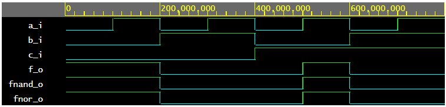
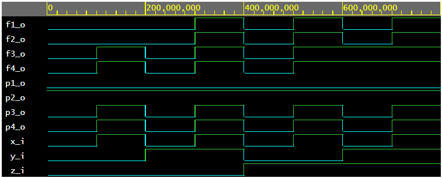

# De Morgan's laws

## Table
| **c** | **b** |**a** | **f(c,b,a)** |
| :-: | :-: | :-: | :-: |
| 0 | 0 | 0 | 1 |
| 0 | 0 | 1 | 1 |
| 0 | 1 | 0 | 0 |
| 0 | 1 | 1 | 0 |
| 1 | 0 | 0 | 0 |
| 1 | 0 | 1 | 1 |
| 1 | 1 | 0 | 0 |
| 1 | 1 | 1 | 0 |

<br>

## Code

```vhdl
------------------------------------------------------------------------
--
-- Example of basic OR, AND, XOR gates.
-- Nexys A7-50T, Vivado v2020.1, EDA Playground
--
-- Copyright (c) 2019-2020 Tomas Fryza
-- Dept. of Radio Electronics, Brno University of Technology, Czechia
-- This work is licensed under the terms of the MIT license.
--
------------------------------------------------------------------------

library ieee;               -- Standard library
use ieee.std_logic_1164.all;-- Package for data types and logic operations

------------------------------------------------------------------------
-- Entity declaration for basic gates
------------------------------------------------------------------------
entity gates is
    port(
        a_i    : in  std_logic;         -- Data input
        b_i    : in  std_logic;         -- Data input
        c_i	   : in  std_logic;         -- Data input
        f_o    : out std_logic;         -- OR output function
        fnand_o: out std_logic;         -- NAND output function
        fnor_o : out std_logic          -- NOR output function
    );
end entity gates;

------------------------------------------------------------------------
-- Architecture body for basic gates
------------------------------------------------------------------------
architecture dataflow of gates is
begin
    f_o  <= ((not b_i) and a_i) or ((not c_i) and (not b_i));
    fnand_o <= ((b_i nand b_i) nand a_i) nand ((c_i nand c_i) nand (b_i nand b_i));
    fnor_o <= ((b_i nor (a_i nor a_i)) nor (b_i nor c_i)) nor ((b_i nor (a_i nor a_i)) nor (b_i nor c_i));

end architecture dataflow;
```

## Result



## Link

[EDA Playground link for De morgan's laws](https://www.edaplayground.com/x/pL_P)

<br>

# Distributive laws

## Code

```vhdl
library ieee;
use ieee.std_logic_1164.all;

----------------------------------------------------------------------

entity gates is
	port(
    	x_i    : in  std_logic;         -- Data input
        y_i    : in  std_logic;         -- Data input
        z_i	   : in  std_logic;         -- Data input
        
        p1_o   : out std_logic;			-- Postulate no.1
        p2_o   : out std_logic;			-- Postulate no.2
        p3_o   : out std_logic;			-- Postulate no.3
        p4_o   : out std_logic;			-- Postulate no.4
        
        f1_o   : out std_logic;			-- Function no.1
        f2_o   : out std_logic;			-- Function no.2
        f3_o   : out std_logic;			-- Function no.3
        f4_o   : out std_logic			-- Function no.4
    );
end entity gates;

------------------------------------------------------------------------
-- Architecture body for basic gates
------------------------------------------------------------------------

architecture dataflow of gates is
begin
    p1_o   <= x_i and (not x_i);
    p2_o   <= x_i or (not x_i);
    p3_o   <= x_i or x_i or x_i;
    p4_o   <= x_i and x_i and x_i;
    
    f1_o   <= (x_i and y_i) or (x_i and z_i);
    f2_o   <= x_i and (y_i or z_i);
    f3_o   <= (x_i or y_i) and (x_i or z_i);
    f4_o   <= x_i or (y_i and z_i);
    
end architecture dataflow;
```

## Result



## Link

[EDA Playground link for Distributive laws](https://www.edaplayground.com/x/pSTp)