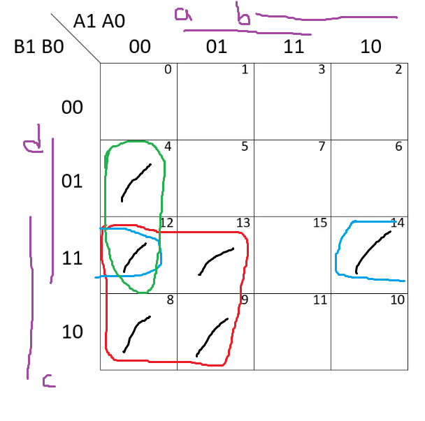
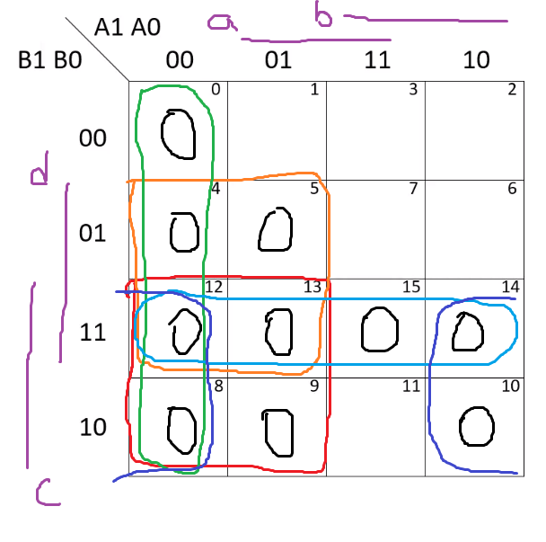
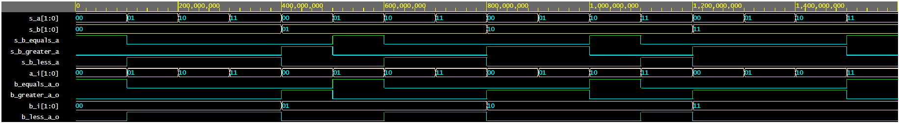
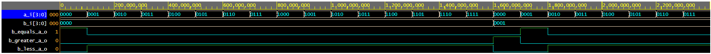

## My DE1 repisitory link

[DE1 - Jiří Navrátil 222721](https://github.com/GeorgeNavratil/Digital-electronics-1)

# Combinational logic

## Truth table

| **Dec. equivalent** | **B[1:0]** | **A[1:0]** | **B > A** | **B = A** | **B is < A** |
| :-: | :-: | :-: | :-: | :-: | :-: |
| 0  | 0 0 | 0 0 | 0 | 1 | 0 |
| 1  | 0 0 | 0 1 | 0 | 0 | 1 |
| 2  | 0 0 | 1 0 | 0 | 0 | 1 |
| 3  | 0 0 | 1 1 | 0 | 0 | 1 |
| 4  | 0 1 | 0 0 | 1 | 0 | 0 |
| 5  | 0 1 | 0 1 | 0 | 1 | 0 |
| 6  | 0 1 | 1 0 | 0 | 0 | 1 |
| 7  | 0 1 | 1 1 | 0 | 0 | 1 |
| 8  | 1 0 | 0 0 | 1 | 0 | 0 |
| 9  | 1 0 | 0 1 | 1 | 0 | 0 |
| 10 | 1 0 | 1 0 | 0 | 1 | 0 |
| 11 | 1 0 | 1 1 | 0 | 0 | 1 |
| 12 | 1 1 | 0 0 | 1 | 0 | 0 |
| 13 | 1 1 | 0 1 | 1 | 0 | 0 |
| 14 | 1 1 | 1 0 | 1 | 0 | 0 |
| 15 | 1 1 | 1 1 | 0 | 1 | 0 |

<br>

equals_SoP = !a!b!c!d + !dc!ba + d!cb!a + dcba

less_PoS = (d+c+b+a) (d+!c+b+a) (d+!c+b+!a) (!d+c+b+a) (!d+c+b+!a) (!d+c+!+a) (!d+!c+b+a) (!d+!c+b+!a) (!d+!c+!b+a) (!d+!c+!b+!a)

<br>

## Karnaugh Maps

### Karnaugh map for "equals" function


### Karnaugh map for "greater than" function



greater_SoP_min = c!b + d!b!a + dc!a

### Karnaugh map for "less than" function



less_PoS_min = (!c + !b) * (!d + !b) * (!c + a) * (a + b) * (!d + !c)

## 2-bit Karnaugh map

### Result



### Link

[EDA Playground link for 2-bit Karnaugh map](https://www.edaplayground.com/x/8Qrp)

## 4-bit Karnaugh map

### Design Code

```vhdl
library ieee;
use ieee.std_logic_1164.all;

------------------------------------------------------------------------
-- Entity declaration for 4-bit binary comparator
------------------------------------------------------------------------
entity comparator_4bit is
    port(
        a_i           : in  std_logic_vector(4 - 1 downto 0);
        b_i           : in  std_logic_vector(4 - 1 downto 0);

        -- COMPLETE ENTITY DECLARATION
		B_greater_A_o : out std_logic;
		B_equals_A_o  : out std_logic;
        B_less_A_o    : out std_logic       -- B is less than A
    );
end entity comparator_4bit;

------------------------------------------------------------------------
-- Architecture body for 4-bit binary comparator
------------------------------------------------------------------------
architecture Behavioral of comparator_4bit is
begin
	B_greater_A_o<= '1' when (b_i > a_i) else '0';
	B_equals_A_o <= '1' when (b_i = a_i) else '0';
    B_less_A_o   <= '1' when (b_i < a_i) else '0';

end architecture Behavioral;
```

### Testbanch Code

```vhdl
library ieee;
use ieee.std_logic_1164.all;

------------------------------------------------------------------------
-- Entity declaration for testbench
------------------------------------------------------------------------
entity tb_comparator_4bit is
    -- Entity of testbench is always empty
end entity tb_comparator_4bit;

------------------------------------------------------------------------
-- Architecture body for testbench
------------------------------------------------------------------------
architecture testbench of tb_comparator_4bit is

    -- Local signals
    signal s_a       : std_logic_vector(4 - 1 downto 0);
    signal s_b       : std_logic_vector(4 - 1 downto 0);
    signal s_B_greater_A : std_logic;
    signal s_B_equals_A  : std_logic;
    signal s_B_less_A    : std_logic;

begin
    -- Connecting testbench signals with comparator_2bit entity (Unit Under Test)
    uut_comparator_4bit : entity work.comparator_4bit
        port map(
            a_i           => s_a,
            b_i           => s_b,
            B_greater_A_o => s_B_greater_A,
            B_equals_A_o  => s_B_equals_A,
            B_less_A_o    => s_B_less_A
        );

    --------------------------------------------------------------------
    -- Data generation process
    --------------------------------------------------------------------
    p_stimulus : process
    begin
        -- Report a note at the begining of stimulus process
        report "Stimulus process started" severity note;


      	s_b <= "0000"; s_a <= "0000"; wait for 100 ns;
        assert ((s_B_greater_A = '0') and (s_B_equals_A = '1') and (s_B_less_A = '0'))
        report "Test failed for input combination: 0000, 0000" severity error;

        s_b <= "0000"; s_a <= "0001"; wait for 100 ns;
        assert ((s_B_greater_A = '0') and (s_B_equals_A = '0') and (s_B_less_A = '1'))
        report "Test failed for input combination: 0000, 0001" severity error;

        s_b <= "0000"; s_a <= "0010"; wait for 100 ns;
        assert ((s_B_greater_A = '0') and (s_B_equals_A = '0') and (s_B_less_A = '1'))
        report "Test failed for input combination: 0000, 0010" severity error;

        s_b <= "0000"; s_a <= "0011"; wait for 100 ns;
        assert ((s_B_greater_A = '0') and (s_B_equals_A = '0') and (s_B_less_A = '1'))
        report "Test failed for input combination: 0000, 0011" severity error;

        s_b <= "0000"; s_a <= "0100"; wait for 100 ns;
        assert ((s_B_greater_A = '0') and (s_B_equals_A = '0') and (s_B_less_A = '1'))
        report "Test failed for input combination: 0000, 0100" severity error;

        s_b <= "0000"; s_a <= "0101"; wait for 100 ns;
        assert ((s_B_greater_A = '0') and (s_B_equals_A = '0') and (s_B_less_A = '1'))
        report "Test failed for input combination: 0000, 0101" severity error;

        s_b <= "0000"; s_a <= "0110"; wait for 100 ns;
        assert ((s_B_greater_A = '0') and (s_B_equals_A = '0') and (s_B_less_A = '1'))
        report "Test failed for input combination: 0000, 0110" severity error;

        s_b <= "0000"; s_a <= "0111"; wait for 100 ns;
        assert ((s_B_greater_A = '0') and (s_B_equals_A = '0') and (s_B_less_A = '1'))
        report "Test failed for input combination: 0000, 0111" severity error;

        s_b <= "0000"; s_a <= "1000"; wait for 100 ns;
        assert ((s_B_greater_A = '0') and (s_B_equals_A = '0') and (s_B_less_A = '1'))
        report "Test failed for input combination: 0000, 1000" severity error;

        s_b <= "0000"; s_a <= "1001"; wait for 100 ns;
        assert ((s_B_greater_A = '0') and (s_B_equals_A = '0') and (s_B_less_A = '1'))
        report "Test failed for input combination: 0000, 1001" severity error;

        s_b <= "0000"; s_a <= "1010"; wait for 100 ns;
        assert ((s_B_greater_A = '0') and (s_B_equals_A = '0') and (s_B_less_A = '1'))
        report "Test failed for input combination: 0000, 1010" severity error;

        s_b <= "0000"; s_a <= "1011"; wait for 100 ns;
        assert ((s_B_greater_A = '0') and (s_B_equals_A = '0') and (s_B_less_A = '1'))
        report "Test failed for input combination: 0000, 1011" severity error;

        s_b <= "0000"; s_a <= "1100"; wait for 100 ns;
        assert ((s_B_greater_A = '0') and (s_B_equals_A = '0') and (s_B_less_A = '1'))
        report "Test failed for input combination: 0000, 1100" severity error;

        s_b <= "0000"; s_a <= "1101"; wait for 100 ns;
        assert ((s_B_greater_A = '0') and (s_B_equals_A = '0') and (s_B_less_A = '1'))
        report "Test failed for input combination: 0000, 1101" severity error;

        s_b <= "0000"; s_a <= "1110"; wait for 100 ns;
        assert ((s_B_greater_A = '0') and (s_B_equals_A = '0') and (s_B_less_A = '1'))
        report "Test failed for input combination: 0000, 1110" severity error;

        s_b <= "0000"; s_a <= "1111"; wait for 100 ns;
        assert ((s_B_greater_A = '0') and (s_B_equals_A = '0') and (s_B_less_A = '1'))
        report "Test failed for input combination: 0000, 1111" severity error;

        s_b <= "0001"; s_a <= "0000"; wait for 100 ns;
        assert ((s_B_greater_A = '1') and (s_B_equals_A = '0') and (s_B_less_A = '0'))
        report "Test failed for input combination: 0001, 0000" severity error;

        s_b <= "0001"; s_a <= "0001"; wait for 100 ns;
        assert ((s_B_greater_A = '0') and (s_B_equals_A = '1') and (s_B_less_A = '0'))
        report "Test failed for input combination: 0001, 0001" severity error;

        s_b <= "0001"; s_a <= "0010"; wait for 100 ns;
        assert ((s_B_greater_A = '0') and (s_B_equals_A = '0') and (s_B_less_A = '1'))
        report "Test failed for input combination: 0001, 0010" severity error;

        s_b <= "0001"; s_a <= "0011"; wait for 100 ns;
        assert ((s_B_greater_A = '0') and (s_B_equals_A = '0') and (s_B_less_A = '1'))
        report "Test failed for input combination: 0001, 0011" severity error;

        s_b <= "0001"; s_a <= "0100"; wait for 100 ns;
        assert ((s_B_greater_A = '0') and (s_B_equals_A = '0') and (s_B_less_A = '1'))
        report "Test failed for input combination: 0001, 0100" severity error;

        s_b <= "0001"; s_a <= "0101"; wait for 100 ns;
        assert ((s_B_greater_A = '0') and (s_B_equals_A = '0') and (s_B_less_A = '1'))
        report "Test failed for input combination: 0001, 0101" severity error;

        s_b <= "0001"; s_a <= "0110"; wait for 100 ns;
        assert ((s_B_greater_A = '0') and (s_B_equals_A = '0') and (s_B_less_A = '1'))
        report "Test failed for input combination: 0001, 0110" severity error;

        s_b <= "0001"; s_a <= "0111"; wait for 100 ns;
        assert ((s_B_greater_A = '0') and (s_B_equals_A = '0') and (s_B_less_A = '1'))
        report "Test failed for input combination: 0001, 0111" severity error;

		
        -- Report a note at the end of stimulus process
        report "Stimulus process finished" severity note;
        wait;
    end process p_stimulus;

end architecture testbench;
```

### Error example

```
elaborate tb_comparator_4bit
testbench.vhd:51:9:@0ms:(report note): Stimulus process started
testbench.vhd:67:9:@400ns:(assertion error): Test failed for input combination: 0000, 0011
testbench.vhd:95:9:@1100ns:(assertion error): Test failed for input combination: 0000, 1010
testbench.vhd:123:9:@1800ns:(assertion error): Test failed for input combination: 0001, 0001
testbench.vhd:139:9:@2200ns:(assertion error): Test failed for input combination: 0001, 0101
testbench.vhd:152:9:@2400ns:(report note): Stimulus process finished
Finding VCD file...
```

### Result



### Link

[EDA Playground link for 4-bit Karnaugh map](https://www.edaplayground.com/x/7Vnd)