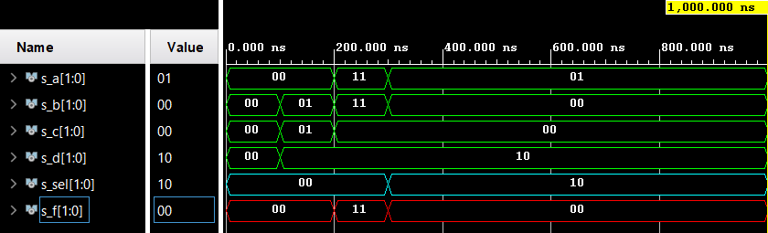
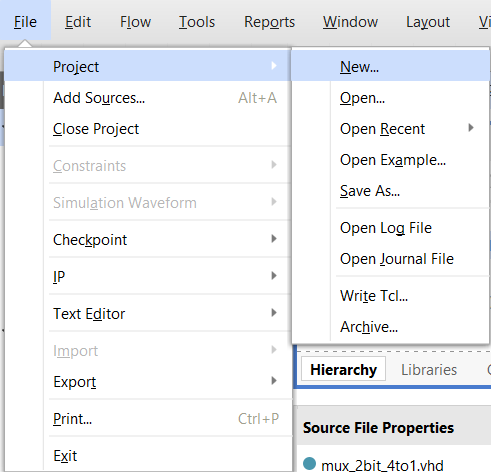
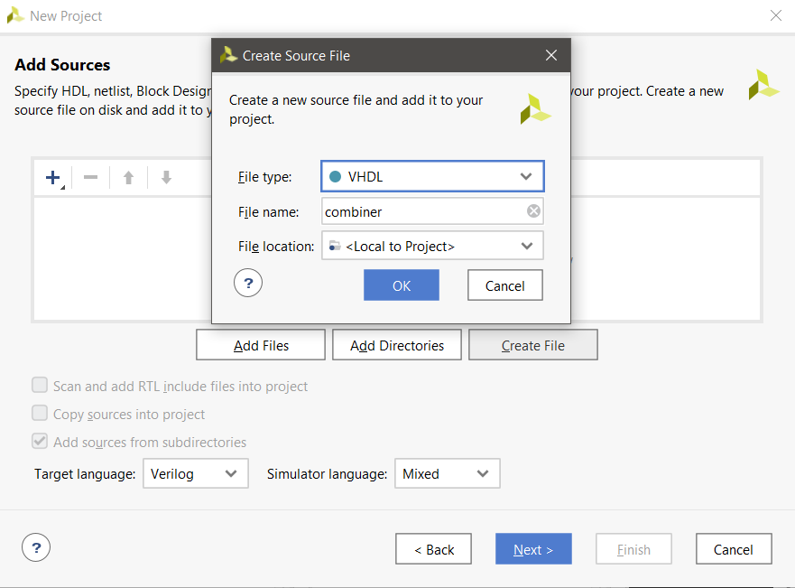
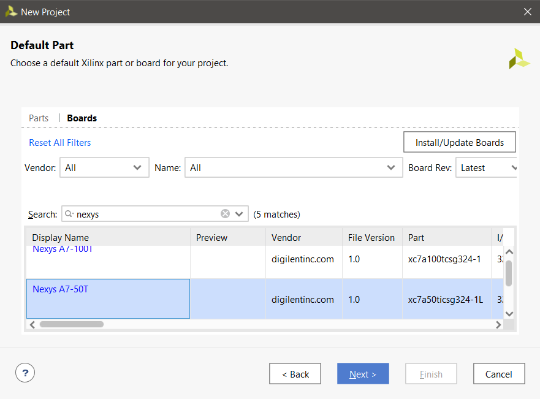
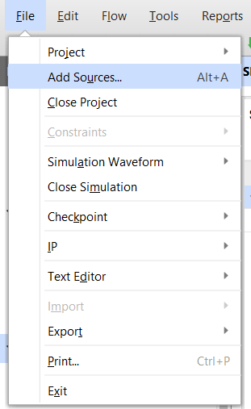
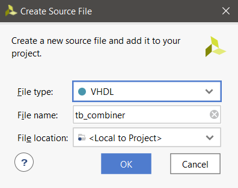
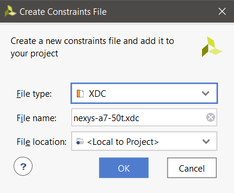
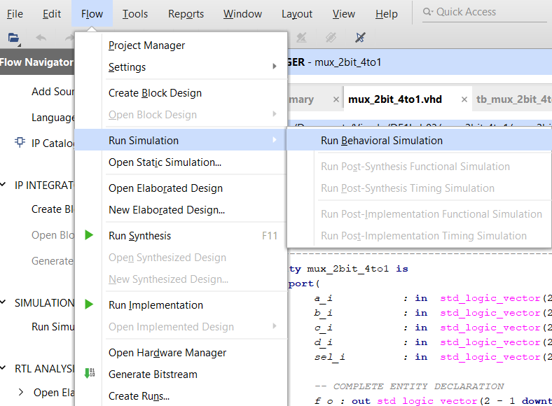

## My DE1 repisitory link

[DE1 - Jiří Navrátil 222721](https://github.com/GeorgeNavratil/Digital-electronics-1)

# Vivado

## Board connections - general

| **Switch** | **FPGA pin** | **FPGA pin name** |
| :-: | :-: | :-: |
| SW[0] | IO_L24N_T3_RS0_15 |  J15 |
| SW[1] | IO_L3N_T0_DQS_EMCCLK_14 |  L16 |
| SW[2] | IO_L6N_T0_D08_VREF_14 |  M13 |
| SW[3] | IO_L13N_T2_MRCC_14 |  R15 |
| SW[4] | IO_L12N_T1_MRCC_14 |  R17 |
| SW[5] | IO_L7N_T1_D10_14 |  T18 |
| SW[6] | IO_L17N_T2_A13_D29_14 |  U18 |
| SW[7] | IO_L5N_T0_D07_14 |  R13 |
| SW[8] | IO_L24N_T3_34 |  T8 |
| SW[9] | IO_25_34 |  U8 |
| SW[10] | IO_L15P_T2_DQS_RDWR_B_14 |  R16 |
| SW[11] | IO_L23P_T3_A03_D19_14 |  T13 |
| SW[12] | IO_L24P_T3_35 |  H6 |
| SW[13] | IO_L20P_T3_A08_D24_14 |  U12 |
| SW[14] | IO_L19N_T3_A09_D25_VREF_14 |  U11 |
| SW[15] | IO_L21P_T3_DQS_14 |  V10 |

<br>

| **LED** | **FPGA pin** | **FPGA pin name** |
| :-: | :-: | :-: |
| LED[0] | IO_L18P_T2_A24_15 |  H17 |
| LED[1] | IO_L24P_T3_RS1_15 |  K15 |
| LED[2] | IO_L17N_T2_A25_15 |  J13 |
| LED[3] | IO_L8P_T1_D11_14 |  N14 |
| LED[4] | IO_L7P_T1_D09_14 |  R18 |
| LED[5] | IO_L18N_T2_A11_D27_14 |  V17 |
| LED[6] | IO_L17P_T2_A14_D30_14 |  U17 |
| LED[7] | IO_L18P_T2_A12_D28_14 |  U16 |
| LED[8] | IO_L16N_T2_A15_D31_14 |  V16 |
| LED[9] | IO_L14N_T2_SRCC_14 |  T15 |
| LED[10] | IO_L22P_T3_A05_D21_14 |  U14 |
| LED[11] | IO_L15N_T2_DQS_DOUT_CSO_B_14 |  T16 |
| LED[12] | IO_L16P_T2_CSI_B_14 |  V15 |
| LED[13] | IO_L22N_T3_A04_D20_14 |  V14 |
| LED[14] | IO_L20N_T3_A07_D23_14 |  V12 |
| LED[15] | IO_L21N_T3_DQS_A06_D22_14 |  V11 |

<br>

## Board connections - our links

| **Port** | **Linked to** | **Pin** |
| :-: | :-: | :-: |
| a_i[0] | SW[0] | J15 |
| a_i[1] | SW[1] | L16 |
| b_i[0] | SW[2] | M13 |
| b_i[1] | SW[3] | R15 |
| c_i[0] | SW[4] | R17 |
| c_i[1] | SW[5] | T18 |
| d_i[0] | SW[6] | U18 |
| d_i[1] | SW[7] | R13 |
| sel_i[0] | SW[14] | U11 |
| sel_i[1] | SW[15] | V10 |
| f_o[0] | LED[14] | H17 |
| f_o[1] | LED[15] | K15 |

<br>

## 2-bit wide 4-to-1 multiplexer

### Architecture syntax

```vhdl
architecture Behavioral of mux_2bit_4to1 is
begin

	f_o    <= a_i when (sel_i = "00") else 
	          b_i when (sel_i = "01") else 
	          c_i when (sel_i = "10") else
	          d_i;

end architecture Behavioral;
```

### Stimulus syntax

```vhdl
p_stimulus : process
    begin
        -- Report a note at the begining of stimulus process
        report "Stimulus process started" severity note;

        s_d <= "00"; s_c <= "00"; s_b <= "00"; s_a <= "00"; s_sel <= "00"; wait for 100 ns;
        
        s_d <= "10"; s_c <= "01"; s_b <= "01"; s_a <= "00"; s_sel <= "00"; wait for 100 ns;
        
        s_d <= "10"; s_c <= "00"; s_b <= "11"; s_a <= "11"; s_sel <= "00"; wait for 100 ns;
        
        s_d <= "10"; s_c <= "00"; s_b <= "00"; s_a <= "01"; s_sel <= "10"; wait for 100 ns;
        
        -- Report a note at the end of stimulus process
        report "Stimulus process finished" severity note;
    wait;
end process p_stimulus;
```

### Result



## Vivado project creation tutorial

### Creating project

1. In the programs Menu bar go to **File** -> **Project** -> **New...**

    

2. After clicking **Next >** you need to specify project name and location

3. Select *RLT Project* with no boxes checked

4. In *Sources* create a new file with **VHDL** file type and define it's name and with **<** **Local to Project** **>** file location

    

5. Skip *Constrains* for now (can be added later)

6. Select a *Part* or *Board* of your choosing

    

7. Click **Finish** and wait for your project to be created

### Add source file

1. In the programs Menu bar go to **File** -> **Add Sources...** or use a keyboard shortcut *Alt+A*

    

2. Choose *Add or create design sources* and click **Next >**

3. Create a new file with **VHDL** file type and define it's name and with **<** **Local to Project** **>** file location

    

4. Click **Finish**

### Add testbench file

1. In the programs Menu bar go to **File** -> **Add Sources...** or use a keyboard shortcut *Alt+A*

    

2. Choose *Add or create simulation sources* and click **Next >**

3. Create a new file with **VHDL** file type and define it's name starting with *tb_...* and with **<** **Local to Project** **>** file location

    

4. Click **Finish**

### Add XDC constraints file

1. In the programs Menu bar go to **File** -> **Add Sources...** or use a keyboard shortcut *Alt+A*

    

2. Choose *Add or create constraints* and click **Next >**

3. Create a new file with **XDC** file type and define it's name ending with *.xdc* and with **<** **Local to Project** **>** file location

    

4. Click **Finish**

### Run simulation

1. In the programs Menu bar go to **Flow** -> **Run Simulation** -> **Run Behavioral Simulation**

    