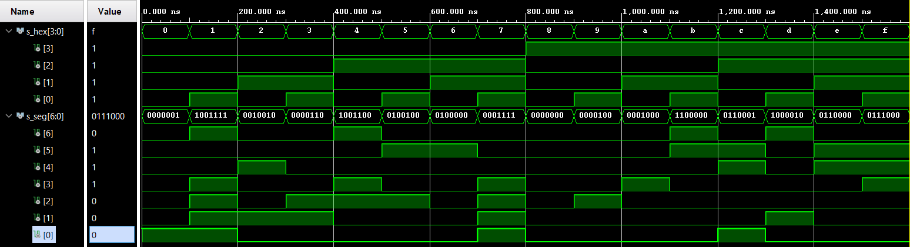

## My DE1 repisitory link

[DE1 - Jiří Navrátil 222721](https://github.com/GeorgeNavratil/Digital-electronics-1)

# Seven-segment display decoder

## Board connections

| **Output pins** | **FPGA pin** | **FPGA pin name** |
| :-: | :-: | :-: |
| CA | IO_L24N_T3_A00_D16_14 | T10 |
| CB | IO_25_14 | R10 |
| CC | IO_25_15 | K16 |
| CD | IO_L17P_T2_A26_15 | K13 |
| CE | IO_L13P_T2_MRCC_14 | P15 |
| CF | IO_L19P_T3_A10_D26_14 | T11 |
| CG | IO_L4P_T0_D04_14 | L18 |
| DP | IO_L19N_T3_A21_VREF_15 | H15 |
| AN0 | IO_L23P_T3_FOE_B_15 | J17 |
| AN1 | IO_L23N_T3_FWE_B_15 | J18 |
| AN2 | IO_L24P_T3_A01_D17_14 | T9 |
| AN3 | IO_L19P_T3_A22_15 | J14 |
| AN4 | IO_L8N_T1_D12_14 | P14 |
| AN5 | IO_L14P_T2_SRCC_14 | T14 |
| AN6 | IO_L23P_T3_35 | K2 |
| AN7 | IO_L23N_T3_A02_D18_14 | U13 |

<br>

## Truth table for 7-segment display

| **Hex** | **Inputs** | **A** | **B** | **C** | **D**| **E** | **F** | **G** |
| :-: | :-: | :-: | :-: | :-: | :-: | :-: | :-: | :-: |
| 0 | 0000 | 0 | 0 | 0 | 0 | 0 | 0 | 1 |
| 1 | 0001 | 1 | 0 | 0 | 1 | 1 | 1 | 1 |
| 2 | 0010 | 0 | 0 | 1 | 0 | 0 | 1 | 0 |
| 3 | 0011 | 0 | 0 | 0 | 0 | 1 | 1 | 0 |
| 4 | 0100 | 1 | 0 | 0 | 1 | 1 | 0 | 0 |
| 5 | 0101 | 0 | 1 | 0 | 0 | 1 | 0 | 0 |
| 6 | 0110 | 1 | 1 | 0 | 0 | 0 | 0 | 0 |
| 7 | 0111 | 0 | 0 | 0 | 1 | 1 | 1 | 1 |
| 8 | 1000 | 0 | 0 | 0 | 0 | 0 | 0 | 0 |
| 9 | 1001 | 0 | 0 | 0 | 0 | 1 | 0 | 0 |
| A | 1010 | 0 | 0 | 0 | 1 | 0 | 0 | 0 |
| b | 1011 | 1 | 1 | 0 | 0 | 0 | 0 | 0 |
| C | 1100 | 0 | 1 | 1 | 0 | 0 | 0 | 1 |
| d | 1101 | 1 | 0 | 0 | 0 | 0 | 1 | 0 |
| E | 1110 | 0 | 1 | 1 | 0 | 0 | 0 | 0 |
| F | 1111 | 0 | 1 | 1 | 1 | 0 | 0 | 0 |

<br>

## VHDL code for seven-segment display decoder

### Architecture syntax

```vhdl
architecture Behavioral of hex_7seg is
begin
    p_7seg_decoder : process(hex_i)
    begin
        case hex_i is
            when "0000" =>
                seg_o <= "0000001";     -- 0
            when "0001" =>
                seg_o <= "1001111";     -- 1
            when "0010" =>
                seg_o <= "0010010";     -- 2
            when "0011" =>
                seg_o <= "0000110";     -- 3
            when "0100" =>
                seg_o <= "1001100";     -- 4
            when "0101" =>
                seg_o <= "0100100";     -- 5
            when "0110" =>
                seg_o <= "1100000";     -- 6
            when "0111" =>
                seg_o <= "0001111";     -- 7
            when "1000" =>
                seg_o <= "0000000";     -- 8
            when "1001" =>
                seg_o <= "0000100";     -- 9
            when "1010" =>
                seg_o <= "0001000";     -- A
            when "1011" =>
                seg_o <= "1100000";     -- b
            when "1100" =>
                seg_o <= "0110001";     -- C
            when "1101" =>
                seg_o <= "1000010";     -- d    
            when "1110" =>
                seg_o <= "0110000";     -- E
            when others =>
                seg_o <= "0111000";     -- F
        end case;
    end process p_7seg_decoder;

end Behavioral;
```

### Stimulus syntax

```vhdl
p_stimulus : process
begin
    -- Report a note at the begining of stimulus process
    report "Stimulus process started" severity note;
    
    s_hex <= "0000"; wait for 100 ns;
    s_hex <= "0001"; wait for 100 ns;
    s_hex <= "0010"; wait for 100 ns;
    s_hex <= "0011"; wait for 100 ns;
    s_hex <= "0100"; wait for 100 ns;
    s_hex <= "0101"; wait for 100 ns;
    s_hex <= "0110"; wait for 100 ns;
    s_hex <= "0111"; wait for 100 ns;
    s_hex <= "1000"; wait for 100 ns;
    s_hex <= "1001"; wait for 100 ns;
    s_hex <= "1010"; wait for 100 ns;
    s_hex <= "1011"; wait for 100 ns;
    s_hex <= "1100"; wait for 100 ns;
    s_hex <= "1101"; wait for 100 ns;
    s_hex <= "1110"; wait for 100 ns;
    s_hex <= "1111"; wait for 100 ns;
    
    report "Stimulus process finished" severity note;
    wait;
end process p_stimulus;
```

### Result



