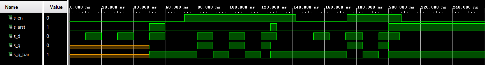
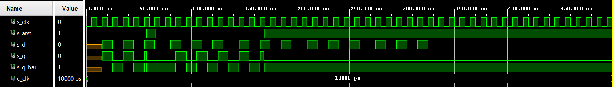
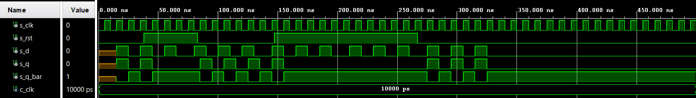
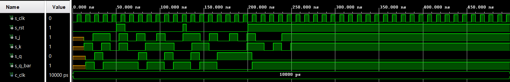
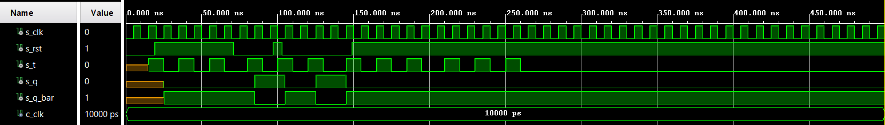
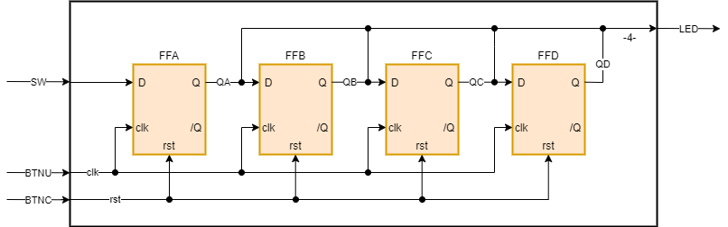

## My DE1 repisitory link

[DE1 - Jiří Navrátil 222721](https://github.com/GeorgeNavratil/Digital-electronics-1)

# Latches and Flip-flops

## Truth table for D flip-flop

| **D** | **Qn** | **Q(n+1)** | **Comments** |
| :-: | :-: | :-: | :-: |
| 0 | 0 | 0 | No change |
| 0 | 1 | 0 | No change |
| 1 | 0 | 1 | Store d if rising edge |
| 1 | 1 | 1 | Store d if rising edge |

<br>

## Truth table for JK flip-flop

| **J** | **K** | **Qn** | **Q(n+1)** | **Comments** |
| :-: | :-: | :-: | :-: | :-: |
| 0 | 0 | 0 | 0 | No change |
| 0 | 0 | 1 | 1 | No change |
| 0 | 1 | 0 | 0 | Reset |
| 0 | 1 | 1 | 0 | Reset |
| 1 | 0 | 0 | 1 | Set |
| 1 | 0 | 1 | 1 | Set |
| 1 | 1 | 0 | 1 | Invert - Toggle |
| 1 | 1 | 1 | 0 | Invert - Toggle |

<br>

## Truth table for JK flip-flop

| **T** | **Qn** | **Q(n+1)** | **Comments** |
| :-: | :-: | :-: | :-: |
| 0 | 0 | 0 | No change |
| 0 | 1 | 1 | No change |
| 1 | 0 | 1 | Invert - Toggle |
| 1 | 1 | 0 | Invert - Toggle |

<br>

## VHDL code for D-latch

### D-latch process

```vhdl
p_d_latch : process (d, arst, en)
begin
    if (arst = '1') then
        q       <= '0';
        q_bar   <= '1';
    elsif (en = '1') then
        q       <= d;
        q_bar   <= not d;
    end if;
end process p_d_latch;
```

### Reset and stimulus processes

```vhdl
p_arst : process
    begin
        s_arst <= '0';
        wait for 50 ns;
        
        -- Reset activated
        s_arst <= '1';
        wait for 10 ns;

        -- Reset deactivated
        s_arst <= '0';
        wait for 66 ns;
        
        s_arst <= '1';
        wait for 4 ns;
        
        s_arst <= '0';
        wait for 70 ns;
        
        s_arst <= '1';
        wait;
end process p_arst;

p_stimulus : process
    begin
        report "Stimulus process started" severity note;
        
        s_en <= '0';
        s_d  <= '0';
        
        wait for 10 ns;
        s_d  <= '1';
        wait for 10 ns;
        s_d  <= '0';
        wait for 10 ns;
        s_d  <= '1';
        wait for 10 ns;
        s_d  <= '0';
        wait for 10 ns;
        s_d  <= '1';
        wait for 10 ns;
        s_d  <= '0';
        
        wait for 12 ns;
        s_en <= '1';
        
        wait for 1 ns;
        assert(s_q = '0' and s_q_bar = '1')
        report "kjsdlkjsgahj" severity error;
        
        wait for 7 ns;
        s_d  <= '1';
        wait for 10 ns;
        s_d  <= '0';
        wait for 10 ns;
        s_d  <= '1';
        wait for 10 ns;
        s_d  <= '0';
        wait for 10 ns;
        s_d  <= '1';
        wait for 10 ns;
        s_d  <= '0';
        
        wait for 12 ns;
        s_en <= '0';
        
        wait for 1 ns;
        assert(s_arst = '0' and s_q = '0' and s_q_bar = '1')
        report "sdoiugfskmbf" severity error;
        
        wait for 10 ns;
        s_d  <= '1';
        wait for 10 ns;
        s_d  <= '0';
        wait for 10 ns;
        s_d  <= '1';
        
        wait for 1 ns;
        s_en <= '1';
        
        wait for 10 ns;
        s_d  <= '0';
        wait for 10 ns;
        s_d  <= '1';
        
        wait for 3 ns;
        assert(s_en = '1' and s_q = '1' and s_q_bar = '0')
        report "aikugsdkb" severity error;
        
        wait for 10 ns;
        s_d  <= '0';
        
        wait for 1 ns;
        s_en <= '0';
        
        wait;
        report "Stimulus process finished" severity note;
end process p_stimulus;
```

### Result



## VHDL code for Flip-flops

### Process of D flip-flop with an async reset

```vhdl
p_d_ff_arst : process (arst, clk)
begin
    if (arst = '1') then
        q       <= '0';
        q_bar   <= '1';
    elsif rising_edge (clk) then
        q       <= d;
        q_bar   <= not d;
    end if;
end process p_d_ff_arst;
```

### Process of D flip-flop with a sync reset

```vhdl
p_d_ff_rst : process (clk)
begin
    if rising_edge(clk) then
        if (rst = '1') then
            q       <= '0';
            q_bar   <= '1';
        else
            q       <= d;
            q_bar   <= not d;
        end if;
    end if;
end process p_d_ff_rst;
```

### Process of JK flip-flop with a sync reset

```vhdl
p_jk_ff_rst : process (clk)
    begin
        if rising_edge (clk) then
            if (rst = '1') then
                s_q <= '0';
            else
                if (j = '0' and k = '0') then
                    s_q <= s_q;
                elsif (j = '0' and k = '1') then
                    s_q <= '0';
                elsif (j = '1' and k = '0') then
                    s_q <= '1';
                elsif (j = '1' and k = '1') then
                    s_q <= not s_q;
                end if;
            end if;
        end if;
end process p_jk_ff_rst;
```

### Process of T flip-flop with a sync reset

```vhdl
p_t_ff_rst : process (clk)
begin
    if rising_edge(clk) then
        if (rst = '1') then
            s_q <= '0';
        else
            if (t = '0') then
                s_q <= s_q;
            else
                s_q <= not s_q;
            end if;
        end if;
    end if;
end process p_t_ff_rst;
```

### Clock, reset and stimulus process of D flip-flop with an async reset

```vhdl
p_arst : process
    begin
        s_arst <= '0';
        wait for 57 ns;
        
        -- Reset activated
        s_arst <= '1';
        wait for 9 ns;

        -- Reset deactivated
        s_arst <= '0';

        wait for 103 ns;
        
        s_arst <= '1';
        
        wait;
end process p_arst;

p_clk_gen : process
    begin
        while now < 750 ns loop         -- 75 periods of 100MHz clock
            s_clk <= '0';
            wait for c_clk / 2;
            s_clk <= '1';
            wait for c_clk / 2;
        end loop;
    wait;
end process p_clk_gen;

p_stimulus : process
    begin
        report "Stimulus process started" severity note;
        
        wait for 15 ns;
        s_d  <= '1';
        wait for 10 ns;
        s_d  <= '0';
        wait for 10 ns;
        s_d  <= '1';
        wait for 10 ns;
        s_d  <= '0';
        wait for 10 ns;
        s_d  <= '1';
        
        wait for 4 ns;
        assert(s_arst = '1' and s_q = '0' and s_q_bar = '1')
        report "gkjagabdaca" severity error;
        
        wait for 6 ns;
        s_d  <= '0';
        
        wait for 15 ns;
        s_d  <= '1';
        wait for 10 ns;
        s_d  <= '0';
        wait for 10 ns;
        s_d  <= '1';
        wait for 10 ns;
        s_d  <= '0';
        wait for 10 ns;
        s_d  <= '1';
        wait for 10 ns;
        s_d  <= '0';
        
        wait for 15 ns;
        s_d  <= '1';
        
        wait for 5 ns;
        assert(s_q = '1' and s_q_bar = '0')
        report "bnoiasona" severity error;
        
        wait for 5 ns;
        s_d  <= '0';
        wait for 10 ns;
        s_d  <= '1';
        wait for 10 ns;
        s_d  <= '0';
        wait for 10 ns;
        s_d  <= '1';
        wait for 10 ns;
        s_d  <= '0';
        
        wait for 15 ns;
        s_d  <= '1';
        wait for 10 ns;
        s_d  <= '0';
        wait for 10 ns;
        s_d  <= '1';
        wait for 10 ns;
        s_d  <= '0';
        wait for 10 ns;
        s_d  <= '1';
        wait for 10 ns;
        s_d  <= '0';
        
        wait for 15 ns;
        s_d  <= '1';
        wait for 10 ns;
        s_d  <= '0';
        wait for 10 ns;
        s_d  <= '1';
        wait for 10 ns;
        s_d  <= '0';
        wait for 10 ns;
        s_d  <= '1';
        wait for 10 ns;
        s_d  <= '0';
        
        wait;
        report "Stimulus process finished" severity note;
end process p_stimulus;
```

### Clock, reset and stimulus process of D flip-flop with a sync reset

```vhdl
p_rst : process
    begin
        s_rst <= '0';
        wait for 38 ns;
        
        -- Reset activated
        s_rst <= '1';
        wait for 45 ns;

        -- Reset deactivated
        s_rst <= '0';

        wait for 64 ns;
        
        s_rst <= '1';
        
        wait for 120 ns;
        
        s_rst <= '0';
        
        wait;
end process p_rst;

p_clk_gen : process
    begin
        while now < 750 ns loop         -- 75 periods of 100MHz clock
            s_clk <= '0';
            wait for c_clk / 2;
            s_clk <= '1';
            wait for c_clk / 2;
        end loop;
    wait;
end process p_clk_gen;

p_stimulus : process
    begin
        report "Stimulus process started" severity note;
        
        wait for 15 ns;
        s_d  <= '1';
        wait for 10 ns;
        s_d  <= '0';
        wait for 10 ns;
        s_d  <= '1';
        wait for 10 ns;
        s_d  <= '0';
        wait for 10 ns;
        s_d  <= '1';
        wait for 10 ns;            
        s_d  <= '0';
        
        wait for 15 ns;
        s_d  <= '1';
        
        wait for 1 ns;
        assert(s_rst = '1' and s_q = '0' and s_q_bar = '1')
        report "falkfabcsc" severity error;
        
        wait for 9 ns;
        s_d  <= '0';
        wait for 10 ns;
        s_d  <= '1';
        wait for 10 ns;
        s_d  <= '0';
        wait for 10 ns;
        s_d  <= '1';
        wait for 10 ns;
        s_d  <= '0';
        
        wait for 15 ns;
        s_d  <= '1';
        
        wait for 5 ns;
        assert(s_rst = '1' and s_q = '1' and s_q_bar = '0')
        report "mnajaoibcax" severity error;
        
        wait for 5 ns;
        s_d  <= '0';
        wait for 10 ns;
        s_d  <= '1';
        wait for 10 ns;
        s_d  <= '0';
        wait for 10 ns;
        s_d  <= '1';
        wait for 10 ns;
        s_d  <= '0';
        
        wait for 15 ns;
        s_d  <= '1';
        wait for 10 ns;
        s_d  <= '0';
        wait for 10 ns;
        s_d  <= '1';
        wait for 10 ns;
        s_d  <= '0';
        wait for 10 ns;
        s_d  <= '1';
        wait for 10 ns;
        s_d  <= '0';
        
        wait for 15 ns;
        s_d  <= '1';
        wait for 10 ns;
        s_d  <= '0';
        wait for 10 ns;
        s_d  <= '1';
        wait for 10 ns;
        s_d  <= '0';
        wait for 10 ns;
        s_d  <= '1';
        wait for 10 ns;
        s_d  <= '0';
        
        wait;
        report "Stimulus process finished" severity note;
end process p_stimulus;
```

### Clock, reset and stimulus process of JK flip-flop with a sync reset

```vhdl
p_rst : process
    begin
        s_rst <= '0';
        wait for 50 ns;
        
        -- Reset activated
        s_rst <= '1';
        wait for 10 ns;

        -- Reset deactivated
        s_rst <= '0';
        wait for 66 ns;
        
        s_rst <= '1';
        wait for 4 ns;
        
        s_rst <= '0';
        wait for 70 ns;
        
        s_rst <= '1';
        wait;
end process p_rst;

p_clk_gen : process
    begin
        while now < 750 ns loop         -- 75 periods of 100MHz clock
            s_clk <= '0';
            wait for c_clk / 2;
            s_clk <= '1';
            wait for c_clk / 2;
        end loop;
    wait;
end process p_clk_gen;

p_stimulus : process
    begin
        report "Stimulus process started" severity note;
        
        wait for 13 ns;
        s_j  <= '0';
        s_k  <= '1';
        wait for 10 ns;
        s_j  <= '1';
        s_k  <= '0';
        wait for 10 ns;
        s_j  <= '1';
        s_k  <= '1';
        wait for 10 ns;
        s_j  <= '0';
        s_k  <= '0';
        
        wait for 8 ns;
        assert(s_rst = '1' and s_j = '0' and s_k = '0' and s_q = '0' and s_q_bar = '1')
        report "oiasogfasnfmx" severity error;
        
        wait for 2 ns;
        s_j  <= '1';
        s_k  <= '1';
        wait for 10 ns;
        s_j  <= '0';
        s_k  <= '0';
        wait for 10 ns;
        s_j  <= '1';
        s_k  <= '0';
        wait for 10 ns;
        s_j  <= '0';
        s_k  <= '1';
        
        wait for 13 ns;
        s_j  <= '1';
        s_k  <= '1';
        wait for 10 ns;
        s_j  <= '0';
        s_k  <= '1';
        wait for 10 ns;
        s_j  <= '0';
        s_k  <= '0';
        wait for 10 ns;
        s_j  <= '1';
        s_k  <= '0';
        wait for 10 ns;
        s_j  <= '1';
        s_k  <= '1';
        
        wait for 5 ns;
        assert(s_rst = '0' and s_j = '1' and s_k = '1' and s_q = '1' and s_q_bar = '0')
        report "psbtdrsmdfs" severity error;
        
        wait for 5 ns;
        s_j  <= '0';
        s_k  <= '1';
        wait for 10 ns;
        s_j  <= '1';
        s_k  <= '0';
        wait for 10 ns;
        s_j  <= '0';
        s_k  <= '0';
        
        wait for 13 ns;
        s_j  <= '1';
        s_k  <= '0';
        wait for 10 ns;
        s_j  <= '0';
        s_k  <= '0';
        wait for 10 ns;
        s_j  <= '1';
        s_k  <= '1';
        wait for 10 ns;
        s_j  <= '0';
        s_k  <= '1';
        wait for 10 ns;
        s_j  <= '0';
        s_k  <= '0';
        wait for 10 ns;
        s_j  <= '0';
        s_k  <= '1';
        wait for 10 ns;
        s_j  <= '1';
        s_k  <= '0';
        wait for 10 ns;
        s_j  <= '1';
        s_k  <= '1';
        
        wait;
        report "Stimulus process finished" severity note;
end process p_stimulus;
```

### Clock, reset and stimulus process of T flip-flop with a sync reset

```vhdl
p_rst : process
    begin
        s_rst <= '0';
        wait for 19 ns;
        
        -- Reset activated
        s_rst <= '1';
        wait for 52 ns;

        -- Reset deactivated
        s_rst <= '0';
        wait for 26 ns;
        
        s_rst <= '1';
        wait for 6 ns;
        
        s_rst <= '0';
        wait for 46 ns;
        
        s_rst <= '1';
        wait;
end process p_rst;

p_clk_gen : process
    begin
        while now < 750 ns loop         -- 75 periods of 100MHz clock
            s_clk <= '0';
            wait for c_clk / 2;
            s_clk <= '1';
            wait for c_clk / 2;
        end loop;
    wait;
end process p_clk_gen;

p_stimulus : process
    begin
        report "Stimulus process started" severity note;
        
        wait for 15 ns;
        s_t  <= '1';
        wait for 10 ns;
        s_t  <= '0';
        wait for 10 ns;
        s_t  <= '1';
        wait for 10 ns;
        s_t  <= '0';
        wait for 10 ns;
        s_t  <= '1';
        
        wait for 6 ns;
        assert(s_rst = '1' and s_t = '1' and s_q = '0' and s_q_bar = '1')
        report "wqljbfmnsdc" severity error;
        
        wait for 4 ns;            
        s_t  <= '0';
        
        wait for 15 ns;
        s_t  <= '1';
        wait for 10 ns;
        s_t  <= '0';
        
        wait for 5 ns;
        assert(s_rst = '0' and s_t = '0' and s_q = '1' and s_q_bar = '0')
        report "rtbjhgsdvambn" severity error;
        
        wait for 5 ns;
        s_t  <= '1';
        wait for 10 ns;
        s_t  <= '0';
        wait for 10 ns;
        s_t  <= '1';
        wait for 10 ns;
        s_t  <= '0';
        
        wait for 15 ns;
        s_t  <= '1';
        wait for 10 ns;
        s_t  <= '0';
        wait for 10 ns;
        s_t  <= '1';
        wait for 10 ns;
        s_t  <= '0';
        wait for 10 ns;
        s_t  <= '1';
        wait for 10 ns;
        s_t  <= '0';
        
        wait for 15 ns;
        s_t  <= '1';
        wait for 10 ns;
        s_t  <= '0';
        wait for 10 ns;
        s_t  <= '1';
        wait for 10 ns;
        s_t  <= '0';
        wait for 10 ns;
        s_t  <= '1';
        wait for 10 ns;
        s_t  <= '0';
        
        wait;
        report "Stimulus process finished" severity note;
end process p_stimulus;
```

### Result of D flip-flop with an async reset



### Result of D flip-flop with a sync reset



### Result of JK flip-flop with a sync reset



### Result of T flip-flop with a sync reset



## Shift register schematic sketch

